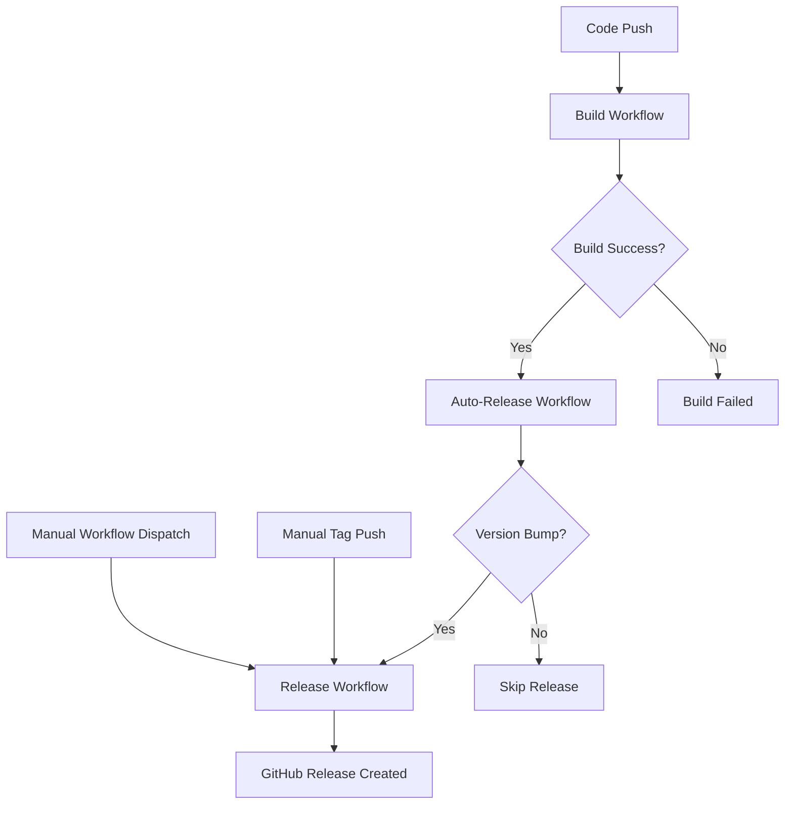

# GitHub Actions Workflows

This directory contains GitHub Actions workflows for automated building, testing, and releasing of StreamCap.

## 📋 Workflow Overview

### 1. Build Application (`build.yml`)
**Trigger:** Push to main/master/develop, Pull Requests, Manual dispatch

**Purpose:** Automatically builds Windows and macOS installers when code changes are detected.

**Features:**
- ✅ Smart change detection (skips builds for documentation-only changes)
- ✅ Cross-platform builds (Windows .exe + installer, macOS .app + .dmg)
- ✅ Dependency caching for faster builds
- ✅ Artifact upload with 30-day retention
- ✅ Build verification and error handling
- ✅ Force build option via manual dispatch

**Outputs:**
- Windows: `StreamCap-{version}-Setup.exe`, `StreamCap-Windows-{version}.zip`
- macOS: `StreamCap-{version}.dmg`, `StreamCap-macOS-{version}.zip`

### 2. Release (`release.yml`)
**Trigger:** Git tags (v*), Manual dispatch

**Purpose:** Creates GitHub releases with installers and comprehensive release notes.

**Features:**
- ✅ Version validation and tag management
- ✅ Automatic version updates in pyproject.toml
- ✅ Professional NSIS installer for Windows
- ✅ Styled DMG installer for macOS
- ✅ Multi-language release notes from config/version.json
- ✅ Automatic changelog generation
- ✅ Draft and pre-release options
- ✅ Asset verification and upload

**Outputs:**
- GitHub Release with all installers
- Comprehensive release notes (English + Chinese)
- Download statistics tracking

### 3. Auto Release (`auto-release.yml`)
**Trigger:** Successful build completion, Manual dispatch

**Purpose:** Automatically triggers releases when version bumps are detected.

**Features:**
- ✅ Monitors build workflow completion
- ✅ Detects version bump commits
- ✅ Prevents duplicate releases
- ✅ Smart commit message analysis
- ✅ Force release option

## 🚀 Usage Guide

### Automatic Release Process

1. **Make code changes** and commit to main/master/develop
2. **Build workflow** automatically runs if relevant files changed
3. **Auto-release workflow** checks for version bumps
4. **Release workflow** creates GitHub release if version changed

### Manual Release Process

#### Option 1: Using Git Tags
```bash
# Create and push a version tag
git tag v1.0.2
git push origin v1.0.2
```

#### Option 2: Using GitHub Actions UI
1. Go to **Actions** → **Release**
2. Click **Run workflow**
3. Enter version (e.g., `v1.0.2`)
4. Configure options (draft, pre-release, etc.)
5. Click **Run workflow**

### Force Build
If you need to build without code changes:
1. Go to **Actions** → **Build Application**
2. Click **Run workflow**
3. Check **Force build** option
4. Click **Run workflow**

## 📝 Version Management

### Updating Version
1. Update version in `pyproject.toml`:
   ```toml
   [project]
   version = "1.0.2"
   ```

2. Add release notes to `config/version.json`:
   ```json
   {
     "version_updates": [
       {
         "version": "1.0.2",
         "kernel_version": "4.0.5",
         "updates": {
           "en": [
             "Added new feature X",
             "Fixed bug Y",
             "Improved performance"
           ],
           "zh_CN": [
             "添加了新功能 X",
             "修复了错误 Y", 
             "提升了性能"
           ]
         }
       }
     ]
   }
   ```

3. Commit with version bump message:
   ```bash
   git commit -m "bump version to 1.0.2"
   # or
   git commit -m "release v1.0.2: add new features"
   ```

### Version Bump Keywords
The auto-release workflow detects these commit message patterns:
- `bump version to X.X.X`
- `release vX.X.X`
- `version X.X.X`
- Any message containing "release" or "version"

## 🔧 Configuration

### Environment Variables
- `PYTHON_VERSION`: Python version for builds (default: 3.11)
- `NODE_VERSION`: Node.js version for builds (default: 20)

### Secrets Required
- `GITHUB_TOKEN`: Automatically provided by GitHub Actions

### Cache Strategy
- Dependencies are cached by OS and Python version
- Cache keys include `poetry.lock` and `pyproject.toml` hashes
- Separate cache for release builds

## 📦 Build Artifacts

### Windows
- **Installer**: Professional NSIS installer with uninstaller
- **Portable**: Zip archive with all dependencies
- **Features**: Start menu shortcuts, desktop shortcut, registry entries

### macOS
- **Installer**: Styled DMG with drag-to-Applications
- **Portable**: Zip archive with .app bundle
- **Features**: Applications folder symlink, proper app bundle structure

## 🐛 Troubleshooting

### Build Failures
1. Check Python/Node.js versions compatibility
2. Verify all dependencies are in requirements files
3. Check for missing assets or config files
4. Review build logs for specific errors

### Release Failures
1. Ensure version format is correct (vX.X.X)
2. Check if tag already exists
3. Verify release notes in config/version.json
4. Check GitHub token permissions

### Auto-Release Not Triggering
1. Verify commit message contains version keywords
2. Check if tag already exists for current version
3. Ensure build workflow completed successfully
4. Review auto-release workflow logs

## 📊 Monitoring

### Build Status
- Check **Actions** tab for workflow status
- Review **Summary** for build artifacts
- Monitor **Cache** usage for optimization

### Release Metrics
- Track download statistics in **Releases**
- Monitor **Issues** for user feedback
- Review **Discussions** for community input

## 🔄 Workflow Dependencies



## 📚 Additional Resources

- [GitHub Actions Documentation](https://docs.github.com/en/actions)
- [Flet Packaging Guide](https://flet.dev/docs/guides/python/packaging-desktop-app)
- [NSIS Documentation](https://nsis.sourceforge.io/Docs/)
- [Poetry Documentation](https://python-poetry.org/docs/)

---

For questions or issues with the workflows, please create an issue in the repository.